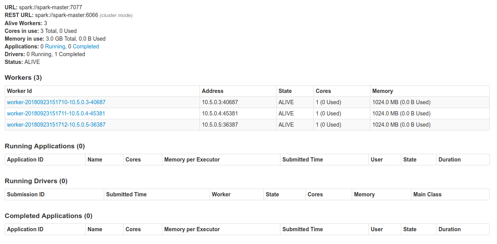
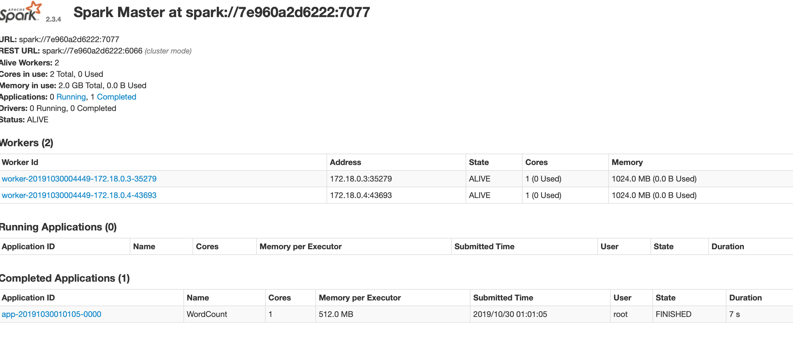

# Spark Cluster with Docker & docker-compose


# Installation

The following steps will make you run your spark cluster's containers.

## Pre requisites

* Docker installed

* Docker compose installed

* Download jdk-8u45-linux-x64.tar.gz and spark-2.3.4-bin-hadoop2.7.tar

* Move jdk-8u45-linux-x64.tar.gz and spark-2.3.4-bin-hadoop2.7.tar to ./docker/base/sofware

## Build the images

The first step to deploy the cluster will be the build of the custom images, these builds can be performed with the *build-images.sh* script. 

The executions is as simple as the following steps:

```sh
chmod +x build-images.sh
./build-images.sh
```

This will create the following docker images:

* spark-base:latest: A base image based on centos:7, java:8 and spark 2.3.4

* spark-master:latest: A image based on the previously created spark image, used to create a spark master containers.

* spark-worker:latest: A image based on the previously created spark image, used to create spark worker containers.

## Run the docker-compose

The final step to create your test cluster will be to run the compose file:

```sh
docker-compose up -d --scale spark-worker=2
```

## Validate your cluster

Just validate your cluster accesing the spark UI on each worker & master URL.

### Spark Master

http://localhost:8080/



# Submit application 

## Work directory introduction

* ./apps:/opt/spark-apps: It's where the application jar is placed

* ./data:/opt/spark-data: It's where the data is placed

* ./result:/opt/spark-result: It is where the execution results are placed


## Submit spark application
```bash
/spark/bin/spark-submit \
  --class com.thoughtworks.spark.WordCount \
  --master spark://spark-master:7077 \
  --executor-memory 512M \
  --total-executor-cores 1 \
  /opt/spark-apps/sparkdemo-1.0.jar \
  /opt/spark-data/word.txt /opt/spark-result/word
```

## Execution results




#Tip
```bash
docker rmi $(docker images -q -a)
docker stop $(docker ps -q) & docker rm $(docker ps -aq)
```